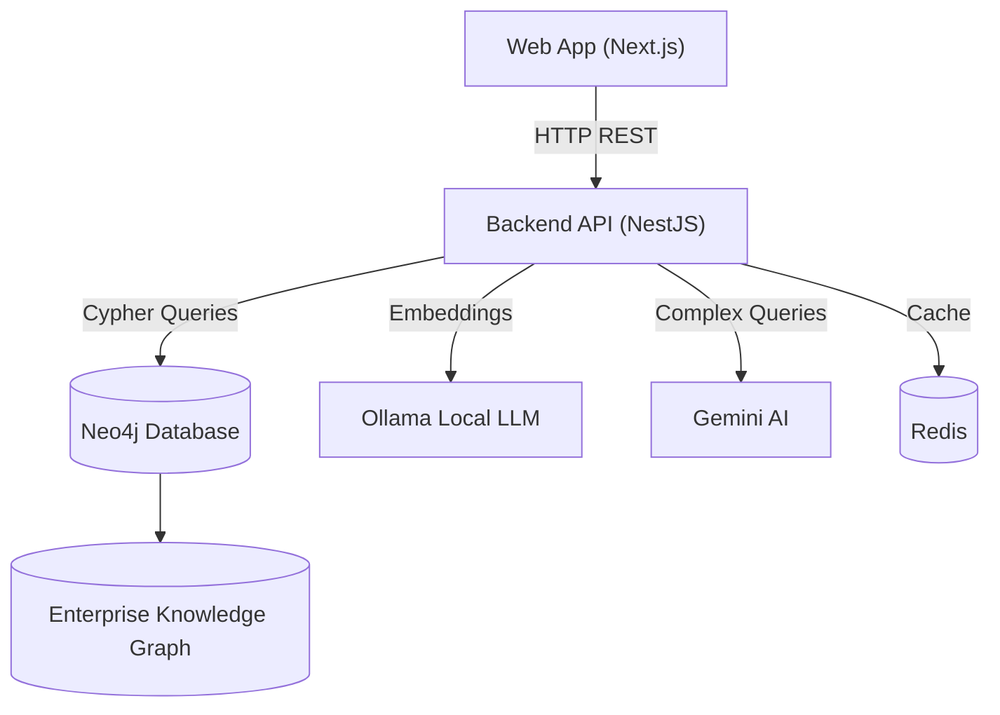

# 🧠 Enterprise Knowledge Graph (EKG) – APTX3107 Company

> 🚀 **Đồ án chuyên ngành HUTECH**  
> **Đề tài:** Xây dựng hệ thống Đồ thị Tri thức Doanh nghiệp (Enterprise Knowledge Graph) cho công ty phần mềm APTX3107.  
> **Công nghệ:** Neo4j · Next.js · NestJS · AI Chat System

---

## 📚 Giới thiệu đề tài

### 🎯 Mục tiêu

- Biểu diễn **tri thức doanh nghiệp phần mềm** dưới dạng **Knowledge Graph** (Neo4j) gồm các thực thể: Nhân sự, Phòng ban, Kỹ năng, Dự án, Chức danh, Công nghệ,...
- Xây dựng hệ thống **API + Web + AI Chatbot** để tra cứu, trực quan hóa và phân tích tri thức.
- Ứng dụng **AI / Chatbot** để hỏi–đáp tri thức doanh nghiệp bằng ngôn ngữ tự nhiên với Ollama + Gemini.

### 🧩 Ý nghĩa

- Giúp công ty hiểu rõ **năng lực nội bộ**, **mối quan hệ nhân sự – kỹ năng – dự án**.
- Hỗ trợ **ra quyết định nhanh** về nhân sự, đào tạo, và phân bổ nguồn lực.
- Là nền tảng cho **Talent Intelligence** và **Enterprise Search**.

---

## 👨‍💻 Nhóm thực hiện

| STT | Họ và Tên                 | Vai trò                      | Nhiệm vụ chính                                                               |
| --- | ------------------------- | ---------------------------- | ---------------------------------------------------------------------------- |
| 1   | **Nguyễn Bình Minh**      | Frontend & Backend Developer | Xây dựng Web (Next.js), Backend API (NestJS), AI Chat Integration.        |
| 2   | **Lại Vũ Hoàng Minh**     | Database Engineer            | Thiết kế Ontology, xây dựng đồ thị tri thức bằng Neo4j, viết Cypher queries. |
| 3   | **Nguyễn Hoàng Anh Khoa** | Tester                       | Kiểm thử hệ thống, viết test case, đánh giá hiệu năng và độ chính xác.       |

---

## 🏗️ Kiến trúc hệ thống



### Tech Stack

| Thành phần              | Công nghệ                                                | Mô tả                                              |
| ----------------------- | -------------------------------------------------------- | -------------------------------------------------- |
| **Frontend Web**        | Next.js 16 + TypeScript + TailwindCSS                  | Giao diện Dashboard, Chat Interface, trực quan hóa KG |
| **Backend API**         | NestJS + TypeScript + neo4j-driver                       | RESTful API, Authentication, Business Logic          |
| **Database**            | Neo4j 5.x + Cypher + APOC                                    | Lưu trữ Knowledge Graph                      |
| **AI Layer** | Ollama (Local LLM) + Gemini API + ChromaDB                          | 3-tier AI Chat System (Simple/Medium/Complex)                           |
| **Caching**             | Redis                                    | Conversation history, Token refresh              |
| **Auth**                | JWT + Passport                                    | Authentication & Authorization (Admin/Viewer)              |
| **Dev Tools**           | Docker Compose, Turbo, ESLint, Prettier               | Development environment & Code quality            |

---

## 🗂️ Cấu trúc dự án

```
ChatBot_Enterprise_knowledge_Graph/
├── ekg-backend/                 # NestJS Backend API
│   ├── src/
│   │   ├── ai/                  # AI services (Ollama, Gemini, ChromaDB)
│   │   ├── auth/                # JWT Authentication
│   │   ├── chat/                # Chat module
│   │   ├── employees/           # Employee endpoints
│   │   ├── departments/         # Department endpoints
│   │   ├── skills/              # Skills endpoints
│   │   └── ...
│   ├── docker-compose.yml       # Neo4j + Redis + Ollama
│   └── README.md
├── ekg-frontend/                # Next.js Frontend
│   └── apps/web/
│       ├── src/
│       │   ├── components/      # React components
│       │   ├── server/services/ # API client services
│       │   └── lib/             # Utilities
│       └── README.md
├── Tài liệu/MD_File/            # � All Documentation
│   ├── 00_Getting_Started/      # Quick start guides
│   ├── 01_Setup_Installation/   # Setup & installation
│   ├── 02_Database_Setup/       # Neo4j & Redis setup
│   ├── 03_Authentication/       # Auth & permissions
│   ├── 04_AI_Chat_System/       # AI & chatbot setup
│   └── 05_Implementation_Summary/ # Reports & summaries
└── README.md                    # This file
```

---

## 🚀 Quick Start

### 📖 Bắt đầu nhanh

**Xem hướng dẫn chi tiết tại:**  
📁 [`Tài liệu/MD_File/00_Getting_Started/`](./Tài%20liệu/MD_File/00_Getting_Started/)

### 1️⃣ Khởi động Backend

```bash
cd ekg-backend
npm install
docker-compose up -d      # Start Neo4j + Redis + Ollama
npm run start:dev         # Start NestJS server
```

**Verify:** Truy cập http://localhost:3002/docs để xem Swagger API

### 2️⃣ Khởi động Frontend

```bash
cd ekg-frontend/apps/web
npm install
npm run dev               # Start Next.js
```

**Verify:** Truy cập http://localhost:3000

### 3️⃣ Test AI Chat

- Vào http://localhost:3000
- Thử chat: "Danh sách nhân viên"
- Chatbot sẽ tương tác với backend và Neo4j

---

## 🧠 Ontology (Domain Model)

**Các Node chính:**

- `CongTy`, `DonVi`, `PhongBan`, `Nhom`
- `NhanSu`, `ChucDanh`, `KyNang`
- `DuAn`, `CongNghe`
- `NguoiDung`, `VaiTro` (Authentication)
- `Conversation`, `Message` (Chat history)

**Các Quan hệ (Relationships):**

| Quan hệ             | Ý nghĩa                   |
| ------------------- | ------------------------- |
| `BAO_CAO_CHO`       | Nhân sự báo cáo cấp trên  |
| `THAM_GIA_NHOM`     | Nhân sự thuộc nhóm        |
| `GIU_CHUC_DANH`     | Giữ vai trò/chức danh     |
| `CO_KY_NANG`        | Nhân sự có kỹ năng        |
| `YEU_CAU_KY_NANG`   | Kỹ năng cần cho chức danh |
| `LAM_DU_AN`         | Nhân sự tham gia dự án    |
| `SU_DUNG_CONG_NGHE` | Dự án sử dụng công nghệ   |
| `CO_VAI_TRO`        | User có role              |
| `HAS_CONVERSATION`  | User có conversation      |

---

## 🤖 AI Chat System

Hệ thống AI Chat với **3-tier intelligent routing**:

### Luồng xử lý

```
User Query
    ↓
Query Classifier (AI-powered)
    ↓
┌─────────────┬─────────────┬─────────────┐
│   Simple    │   Medium    │   Complex   │
│   (30%)     │   (50%)     │   (20%)     │
└─────────────┴─────────────┴─────────────┘
      ↓             ↓             ↓
   Neo4j      Ollama RAG      Gemini
   Direct     (LOCAL!)     (Cloud API)
   Query      <500ms        1-3s
```

### Ví dụ

```
Simple:  "Danh sách nhân viên" → Neo4j → <100ms
Medium:  "Tìm người giỏi Java" → Ollama RAG → <500ms  
Complex: "Tư vấn team cho dự án AI" → Gemini → 1-3s
```

**Chi tiết:** Xem [`Tài liệu/MD_File/04_AI_Chat_System/`](./Tài%20liệu/MD_File/04_AI_Chat_System/)

---

## 🔐 Authentication & Authorization

**Mô hình phân quyền 2-level:**

- **Admin**: Full quyền CRUD trên Knowledge Graph
- **Viewer**: Chỉ được đọc (Read-only)

**Credentials demo:**
- Admin: `admin` / `Admin@123`
- Viewers: `NS001-NS040` / `NSxxx@123`

**Chi tiết:** Xem [`Tài liệu/MD_File/03_Authentication/`](./Tài%20liệu/MD_File/03_Authentication/)

---

## 📚 Tài liệu đầy đủ

Tất cả tài liệu được tổ chức tại **[`Tài liệu/MD_File/`](./Tài%20liệu/MD_File/)**

### 📁 Cấu trúc Documentation

```
Tài liệu/MD_File/
├── 00_Getting_Started/          # 🚀 Bắt đầu nhanh
│   ├── 00_START_HERE.md         # Overview & roadmap
│   ├── QUICK_START.md           # 3-step quick start
│   └── SETUP_METHODS.md         # 3 setup methods
├── 01_Setup_Installation/       # ⚙️ Cài đặt
│   ├── AUTOMATED_STARTUP.md     # Auto-start scripts
│   ├── AUTO_START_DOCKER.md     # Docker auto-start
│   ├── Backend_README.md        # Backend overview
│   └── SETUP_GUIDE.md           # Chi tiết setup
├── 02_Database_Setup/           # 🗄️ Database
│   ├── DATABASE_SETUP.md        # Neo4j setup & seeding
│   ├── REDIS_SETUP_GUIDE.md     # Redis configuration
│   └── TROUBLESHOOTING_DATABASE.md # Fix database issues
├── 03_Authentication/           # 🔐 Phân quyền
│   ├── PhanQuyen_Neo4j_Admin_Viewer.md # Auth model
│   └── SETUP_AUTH.md            # JWT authentication
├── 04_AI_Chat_System/           # 🤖 AI & Chat
│   ├── FRONTEND_CHAT_SETUP.md   # Frontend integration
│   ├── OLLAMA_SETUP.md          # Ollama LLM setup
│   └── TESTING_GUIDE.md         # Chat testing guide
└── 05_Implementation_Summary/   # 📊 Tổng hợp
    ├── EKG_APTX_Document_Backend_Spec.md # Backend spec
    ├── IMPLEMENTATION_COMPLETE.md # FE-BE integration
    ├── IMPLEMENTATION_REPORT.md   # Report với statistics
    ├── IMPLEMENTATION_SUMMARY.md  # AI Chat overview
    ├── INTEGRATION_CHECKLIST.md   # Testing checklist
    ├── INTEGRATION_SUMMARY.md     # Architecture summary
    └── VERIFICATION_CHECKLIST.md  # 7-phase verification
```

### 🎯 Hướng dẫn nhanh

| Tôi muốn...                | Xem file...                              |
| -------------------------- | ---------------------------------------- |
| Bắt đầu nhanh              | `00_Getting_Started/QUICK_START.md`      |
| Setup toàn bộ hệ thống     | `01_Setup_Installation/SETUP_GUIDE.md`   |
| Cấu hình database          | `02_Database_Setup/DATABASE_SETUP.md`    |
| Setup phân quyền           | `03_Authentication/SETUP_AUTH.md`        |
| Cài đặt AI chatbot         | `04_AI_Chat_System/OLLAMA_SETUP.md`      |
| Xem tổng quan triển khai   | `05_Implementation_Summary/IMPLEMENTATION_SUMMARY.md` |

---

## 🔌 API Endpoints

### Core Endpoints

```
GET    /employees              # Danh sách nhân viên
GET    /employees/:id          # Chi tiết nhân viên
POST   /employees              # Tạo nhân viên (Admin only)

GET    /departments            # Danh sách phòng ban
GET    /skills                 # Danh sách kỹ năng
GET    /projects               # Danh sách dự án

GET    /search?q=keyword       # Tìm kiếm toàn bộ
```

### AI Chat Endpoints

```
POST   /chat                   # Process chat message
POST   /chat/index             # Index entities to ChromaDB
GET    /chat/health            # System health check
```

### Authentication

```
POST   /auth/login             # Login → JWT token
GET    /auth/profile           # Get current user info
```

**API Documentation:** http://localhost:3002/docs (Swagger)

---

## 🧪 Chức năng đã triển khai

✅ **Knowledge Graph** - Neo4j với đầy đủ entities & relationships  
✅ **Backend API** - NestJS với RESTful endpoints  
✅ **Frontend Web** - Next.js với chat interface  
✅ **AI Chat System** - 3-tier routing (Neo4j/Ollama/Gemini)  
✅ **Authentication** - JWT với Admin/Viewer roles  
✅ **Conversation History** - Redis-based chat storage  
✅ **Vector Search** - ChromaDB semantic search  
✅ **Auto-startup** - Docker Compose orchestration  
✅ **Documentation** - 22 markdown files organized by features

---

## 📆 Tiến độ đồ án

| Tuần  | Nội dung chính                       | Người phụ trách | Trạng thái |
| ----- | ------------------------------------ | --------------- | ---------- |
| 1–3   | Nghiên cứu EKG & Neo4j               | Toàn nhóm       | ✅         |
| 4–6   | Thiết kế Ontology & mô hình dữ liệu  | Hoàng Minh      | ✅         |
| 7–9   | Import dữ liệu & tạo truy vấn Cypher | Hoàng Minh      | ✅         |
| 10–11 | Xây dựng API & kết nối Neo4j         | Bình Minh       | ✅         |
| 12–13 | Web UI & AI Chat System              | Bình Minh       | ✅         |
| 14    | Test & Fix lỗi                       | Hoàng Anh Khoa  | 🔄         |
| 15    | Demo & Báo cáo                       | Toàn nhóm       | 🔜         |

---

## 🏁 Hướng phát triển tương lai

- ✅ ~~Vector Search (ChromaDB)~~ - **Đã hoàn thành**
- ✅ ~~Chatbot hỏi–đáp tri thức với LLM~~ - **Đã hoàn thành**
- ✅ ~~Role-based Access Control (RBAC)~~ - **Đã hoàn thành**
- [ ] Dashboard phân tích kỹ năng – nhân sự – dự án
- [ ] Mobile App (React Native)
- [ ] Real-time collaboration
- [ ] Advanced analytics & reporting

---

## 📜 Giấy phép & Liên hệ

Dự án thuộc **Đồ án chuyên ngành – Khoa Công nghệ Thông tin, Đại học HUTECH**.  
Tác giả giữ toàn quyền với mã nguồn và nội dung.

📧 **Liên hệ nhóm:** team4.ekg.aptx3107@gmail.com  
📍 **Trường Đại học Công nghệ TP.HCM – HUTECH**

---

> 💡 **Mục tiêu cuối cùng:** EKG trở thành **"bộ não tri thức doanh nghiệp"**, giúp công ty APTX3107 ra quyết định dựa trên dữ liệu tri thức nội bộ với hỗ trợ AI.

**🎉 Hệ thống đã sẵn sàng! Bắt đầu khám phá tri thức doanh nghiệp ngay!**
