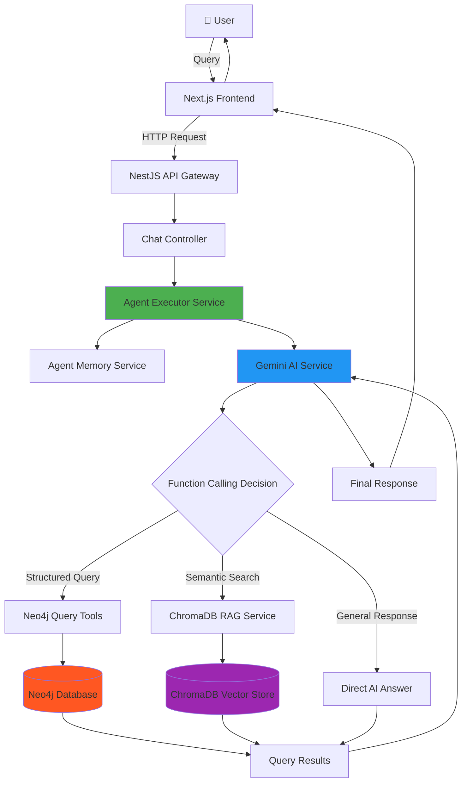
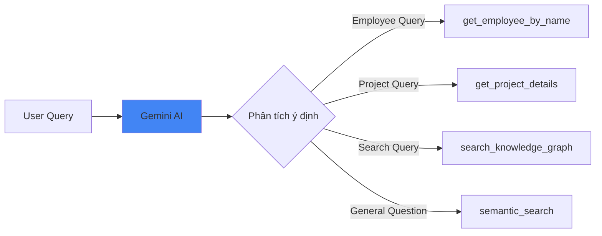

# Kiến Trúc và Cách Hoạt Động Chatbot Enterprise Knowledge Graph

## 📋 Tổng Quan

Chatbot EKG là một hệ thống AI thông minh được xây dựng để trả lời các câu hỏi về dữ liệu doanh nghiệp (nhân viên, phòng ban, dự án, kỹ năng, công nghệ, vị trí, v.v.) bằng cách kết hợp:

- **Neo4j Knowledge Graph**: Lưu trữ dữ liệu quan hệ dạng đồ thị
- **Gemini AI with Function Calling**: Hiểu ngữ cảnh và quyết định cách truy vấn
- **RAG (Retrieval-Augmented Generation)**: Tìm kiếm ngữ nghĩa với ChromaDB
- **Agent-based Architecture**: Xử lý luồng hội thoại và quản lý context

---

## 🏗️ Kiến Trúc Hệ Thống



---

## 🔄 Luồng Xử Lý Chi Tiết

### 1️⃣ **Tiếp Nhận và Phân Tích Query**

```typescript
User Query: "Ai là quản lý dự án ABC?"
    ↓
[Chat Controller] nhận request
    ↓
[Agent Executor] khởi tạo session
    ↓
[Agent Memory] load lịch sử hội thoại
```

### 2️⃣ **AI Intent Classification (Gemini Function Calling)**



**Ví dụ Function Call từ Gemini:**

```json
{
  "function_call": {
    "name": "get_project_manager",
    "arguments": {
      "project_name": "ABC"
    }
  }
}
```

### 3️⃣ **Thực Thi Query trên Neo4j**

```cypher
// Tool: get_project_manager
MATCH (p:Project {name: $project_name})<-[:MANAGES]-(e:Employee)
RETURN e.name, e.role, e.email
```

**Kết quả:**

```json
{
  "manager": {
    "name": "Nguyễn Văn A",
    "role": "Senior Project Manager",
    "email": "a.nguyen@company.com"
  }
}
```

### 4️⃣ **Synthesize Response**

Gemini nhận kết quả và tổng hợp câu trả lời tự nhiên:

```
"Dự án ABC được quản lý bởi Nguyễn Văn A,
với vai trò Senior Project Manager.
Bạn có thể liên hệ qua email: a.nguyen@company.com"
```

---

## 🧩 Các Thành Phần Chính

### **1. Agent Executor Service**

**Vai trò:** Điều phối tổng thể luồng xử lý

```typescript
class AgentExecutorService {
  async executeQuery(sessionId: string, query: string) {
    // 1. Load conversation history
    const context = await this.memoryService.getContext(sessionId);

    // 2. Call Gemini with tools
    const aiResponse = await this.geminiService.chatWithTools(
      query,
      context,
      this.availableTools
    );

    // 3. Execute tool if called
    if (aiResponse.functionCall) {
      const toolResult = await this.executeTool(aiResponse.functionCall);
      const finalResponse = await this.geminiService.synthesize(toolResult);
      return finalResponse;
    }

    // 4. Save to memory
    await this.memoryService.saveInteraction(sessionId, query, aiResponse);

    return aiResponse;
  }
}
```

### **2. Gemini Tools Service**

**Định nghĩa các tools mà AI có thể gọi:**

```typescript
const AVAILABLE_TOOLS = [
  {
    name: "get_employee_by_name",
    description: "Tìm thông tin nhân viên theo tên",
    parameters: {
      employee_name: { type: "string", required: true },
    },
  },
  {
    name: "list_employees_by_department",
    description: "Liệt kê nhân viên trong phòng ban",
    parameters: {
      department_name: { type: "string", required: true },
    },
  },
  {
    name: "get_project_details",
    description: "Lấy chi tiết dự án",
    parameters: {
      project_name: { type: "string", required: true },
    },
  },
  {
    name: "search_by_skill",
    description: "Tìm nhân viên có kỹ năng cụ thể",
    parameters: {
      skill_name: { type: "string", required: true },
      level: { type: "string", required: false },
    },
  },
  {
    name: "semantic_search",
    description: "Tìm kiếm ngữ nghĩa trên toàn bộ knowledge base",
    parameters: {
      query: { type: "string", required: true },
      limit: { type: "number", required: false, default: 5 },
    },
  },
];
```

### **3. Neo4j Query Patterns**

#### 📌 Pattern 1: Tìm nhân viên theo tên

```cypher
MATCH (e:Employee {name: $name})
OPTIONAL MATCH (e)-[:WORKS_IN]->(d:Department)
OPTIONAL MATCH (e)-[:HAS_SKILL]->(s:Skill)
RETURN e, d, collect(s) as skills
```

#### 📌 Pattern 2: Liệt kê nhân viên theo phòng ban

```cypher
MATCH (d:Department {name: $dept})<-[:WORKS_IN]-(e:Employee)
RETURN e.name, e.role, e.email
ORDER BY e.name
```

#### 📌 Pattern 3: Tìm công việc của nhân viên

```cypher
MATCH (e:Employee {name: $name})-[:ASSIGNED_TO]->(t:Task)-[:PART_OF]->(p:Project)
RETURN p.name as project,
       t.title as task,
       t.status as status,
       t.deadline as deadline
ORDER BY t.deadline
```

#### 📌 Pattern 4: Tìm nhân viên theo kỹ năng

```cypher
MATCH (e:Employee)-[:HAS_SKILL]->(s:Skill {name: $skill})
WHERE s.level >= $min_level
RETURN e.name, e.role, s.level
ORDER BY s.level DESC
```

### **4. ChromaDB RAG Service**

**Indexing Documents:**

```typescript
class ChromaIndexingService {
  async indexDocument(doc: Document) {
    // 1. Chunk document
    const chunks = this.chunkDocument(doc.content);

    // 2. Generate embeddings
    const embeddings = await this.geminiService.embed(chunks);

    // 3. Store in ChromaDB
    await this.chromaCollection.add({
      ids: chunks.map((c) => c.id),
      embeddings: embeddings,
      documents: chunks.map((c) => c.text),
      metadatas: chunks.map((c) => ({
        source: doc.source,
        type: doc.type,
        timestamp: doc.timestamp,
      })),
    });
  }
}
```

**Semantic Search:**

```typescript
async semanticSearch(query: string, limit: number = 5) {
  // 1. Embed query
  const queryEmbedding = await this.geminiService.embed(query);

  // 2. Search similar vectors
  const results = await this.chromaCollection.query({
    queryEmbeddings: [queryEmbedding],
    nResults: limit
  });

  // 3. Return ranked results
  return results.documents[0].map((doc, idx) => ({
    content: doc,
    similarity: results.distances[0][idx],
    metadata: results.metadatas[0][idx]
  }));
}
```

### **5. Agent Memory Service**

**Quản lý context hội thoại:**

```typescript
class AgentMemoryService {
  private conversations = new Map<string, ConversationHistory>();

  async getContext(sessionId: string): Promise<Message[]> {
    const history = this.conversations.get(sessionId) || [];
    // Chỉ giữ 10 tin nhắn gần nhất để tiết kiệm token
    return history.slice(-10);
  }

  async saveInteraction(
    sessionId: string,
    userMessage: string,
    aiResponse: string
  ) {
    const history = this.conversations.get(sessionId) || [];
    history.push(
      { role: "user", content: userMessage },
      { role: "assistant", content: aiResponse }
    );
    this.conversations.set(sessionId, history);
  }
}
```

---

## 🎯 Ví Dụ Xử Lý Query Phức Tạp

### **Query:** "Những ai trong phòng IT biết React và đang làm dự án gì?"

#### Step 1: Gemini Phân Tích

```json
{
  "intent": "complex_query",
  "entities": {
    "department": "IT",
    "skill": "React"
  },
  "sub_queries": [
    "find_employees_by_department_and_skill",
    "get_employee_projects"
  ]
}
```

#### Step 2: Thực Thi Tool Chain

**Tool Call 1:** `find_employees_by_department_and_skill`

```cypher
MATCH (d:Department {name: 'IT'})<-[:WORKS_IN]-(e:Employee)-[:HAS_SKILL]->(s:Skill)
WHERE s.name = 'React'
RETURN e.name, e.role, s.level
```

**Result 1:**

```json
[
  { "name": "Trần Văn B", "role": "Frontend Developer", "level": "Advanced" },
  {
    "name": "Lê Thị C",
    "role": "Full-stack Developer",
    "level": "Intermediate"
  }
]
```

**Tool Call 2:** `get_employee_projects` (cho mỗi nhân viên)

```cypher
MATCH (e:Employee {name: $name})-[:ASSIGNED_TO]->(t:Task)-[:PART_OF]->(p:Project)
RETURN DISTINCT p.name, p.status
```

**Result 2:**

```json
{
  "Trần Văn B": [{ "project": "Web Portal", "status": "In Progress" }],
  "Lê Thị C": [
    { "project": "Mobile App", "status": "Planning" },
    { "project": "Admin Dashboard", "status": "In Progress" }
  ]
}
```

#### Step 3: Gemini Tổng Hợp

```
"Trong phòng IT có 2 người biết React:

1. **Trần Văn B** - Frontend Developer (React: Advanced)
   - Đang làm dự án: Web Portal (đang triển khai)

2. **Lê Thị C** - Full-stack Developer (React: Intermediate)
   - Đang làm 2 dự án:
     • Mobile App (đang lên kế hoạch)
     • Admin Dashboard (đang triển khai)

Bạn cần thêm thông tin chi tiết về dự án nào không?"
```

---

## 🔍 Fuzzy Search & Error Handling

### Xử Lý Tên Không Chính Xác

```cypher
// User: "Tìm Nguyễn Văn A" nhưng thực tế là "Nguyễn Văn An"
MATCH (e:Employee)
WHERE toLower(e.name) CONTAINS toLower($keyword)
RETURN e
ORDER BY
  CASE
    WHEN e.name = $keyword THEN 0
    WHEN e.name STARTS WITH $keyword THEN 1
    ELSE 2
  END,
  e.name
LIMIT 5
```

### Gemini Clarification

```typescript
if (results.length > 1) {
  const clarification = `
    Tôi tìm thấy ${results.length} người có tên tương tự:
    ${results.map((r, i) => `${i + 1}. ${r.name} - ${r.role}`).join("\n")}
    
    Bạn muốn xem thông tin của ai?
  `;
  return clarification;
}
```

---

## ⚡ Tối Ưu Hóa Performance

### 1. **Caching Neo4j Queries**

```typescript
@Injectable()
class Neo4jCacheService {
  private cache = new Map<string, { data: any; expiry: number }>();

  async getCached(query: string, params: any, ttl = 60000) {
    const key = `${query}:${JSON.stringify(params)}`;
    const cached = this.cache.get(key);

    if (cached && Date.now() < cached.expiry) {
      return cached.data;
    }

    const result = await this.neo4jService.run(query, params);
    this.cache.set(key, { data: result, expiry: Date.now() + ttl });

    return result;
  }
}
```

### 2. **Lazy Loading cho ChromaDB**

```typescript
// Chỉ call RAG khi Neo4j không trả về kết quả
if (neo4jResults.length === 0) {
  const ragResults = await this.chromaService.semanticSearch(query);
  return this.geminiService.answerFromContext(ragResults);
}
```

### 3. **Parallel Tool Execution**

```typescript
// Nếu cần gọi nhiều tools độc lập
const [employees, projects, skills] = await Promise.all([
  this.getEmployees(),
  this.getProjects(),
  this.getSkills(),
]);
```

---

## 🛡️ Error Handling Strategy

```typescript
try {
  const result = await this.neo4jService.run(query, params);
  return result;
} catch (error) {
  if (error.code === "Neo.ClientError.Statement.SyntaxError") {
    // Fallback to simpler query
    return this.executeFallbackQuery(params);
  } else if (error.code === "Neo.ClientError.Security.Unauthorized") {
    throw new UnauthorizedException("Database access denied");
  } else {
    // Try RAG as last resort
    return this.chromaService.semanticSearch(originalQuery);
  }
}
```

---

## 📊 Monitoring & Logging

```typescript
@Injectable()
class ChatAnalyticsService {
  async logInteraction(data: {
    sessionId: string;
    query: string;
    intent: string;
    toolsCalled: string[];
    responseTime: number;
    userSatisfaction?: number;
  }) {
    // Log to database or analytics service
    await this.analyticsRepo.save({
      ...data,
      timestamp: new Date(),
    });
  }

  async getMetrics() {
    return {
      totalQueries: await this.getTotalQueries(),
      avgResponseTime: await this.getAvgResponseTime(),
      topIntents: await this.getTopIntents(),
      toolUsageStats: await this.getToolUsageStats(),
    };
  }
}
```

---

## 🚀 Mở Rộng Trong Tương Lai

### 1. **Multi-modal Support**

- Upload file PDF/DOCX để index
- Trả lời với charts và visualizations
- Voice input/output

### 2. **Advanced Agent Capabilities**

- Multi-step reasoning
- Proactive suggestions
- Learning from feedback

### 3. **Enterprise Features**

- Role-based access control
- Audit logs
- Multi-tenant support
- Custom knowledge domains per department

---

## 📚 Tech Stack Summary

| Component    | Technology          | Purpose                        |
| ------------ | ------------------- | ------------------------------ |
| Backend      | NestJS + TypeScript | API & Business Logic           |
| Frontend     | Next.js + React     | User Interface                 |
| Database     | Neo4j               | Knowledge Graph Storage        |
| Vector Store | ChromaDB            | Semantic Search                |
| AI Model     | Google Gemini       | Natural Language Understanding |
| LLM Fallback | Ollama (Qwen2.5:7b) | Local inference option         |
| Embeddings   | Gemini Embeddings   | Text vectorization             |

---

## 🔗 Tham Khảo

- [Neo4j Cypher Manual](https://neo4j.com/docs/cypher-manual/)
- [Gemini Function Calling](https://ai.google.dev/docs/function_calling)
- [LangChain Agent Patterns](https://js.langchain.com/docs/modules/agents/)
- [RAG Best Practices](https://www.pinecone.io/learn/retrieval-augmented-generation/)

---

**Tài liệu được tạo bởi:** Antigravity AI Assistant  
**Ngày cập nhật:** 2025-11-28
